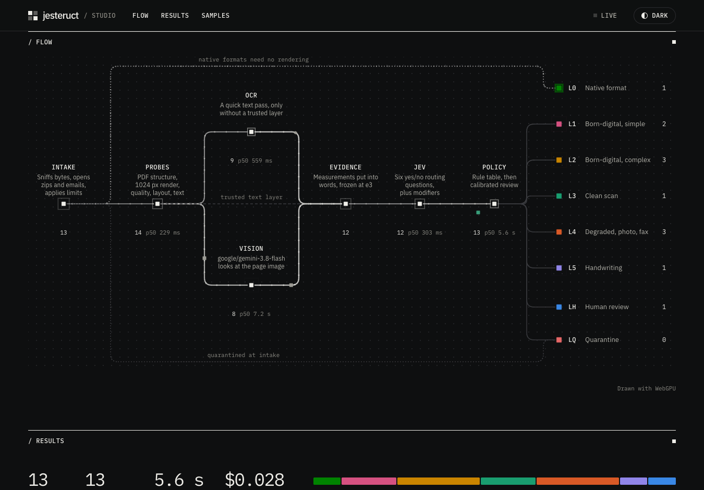
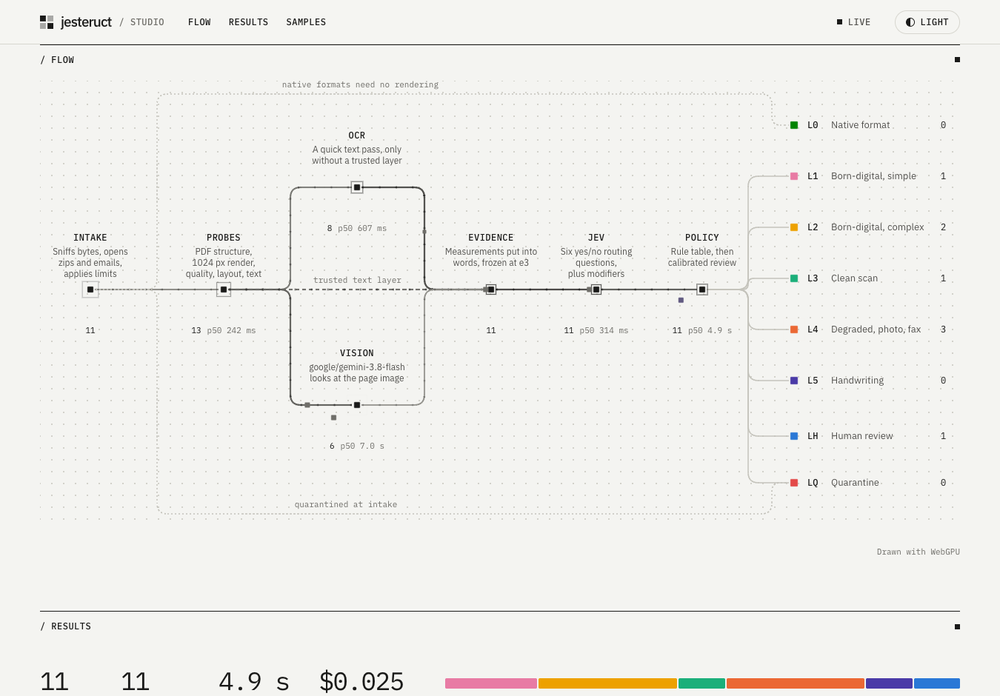
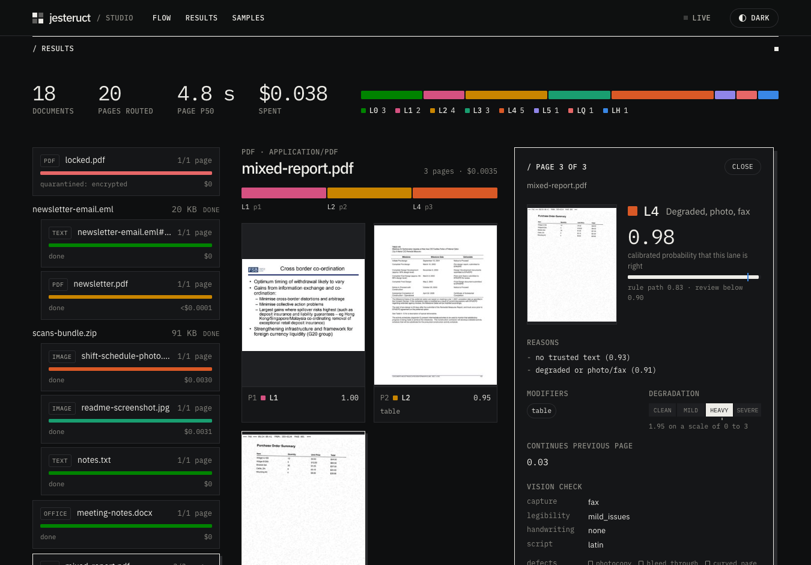
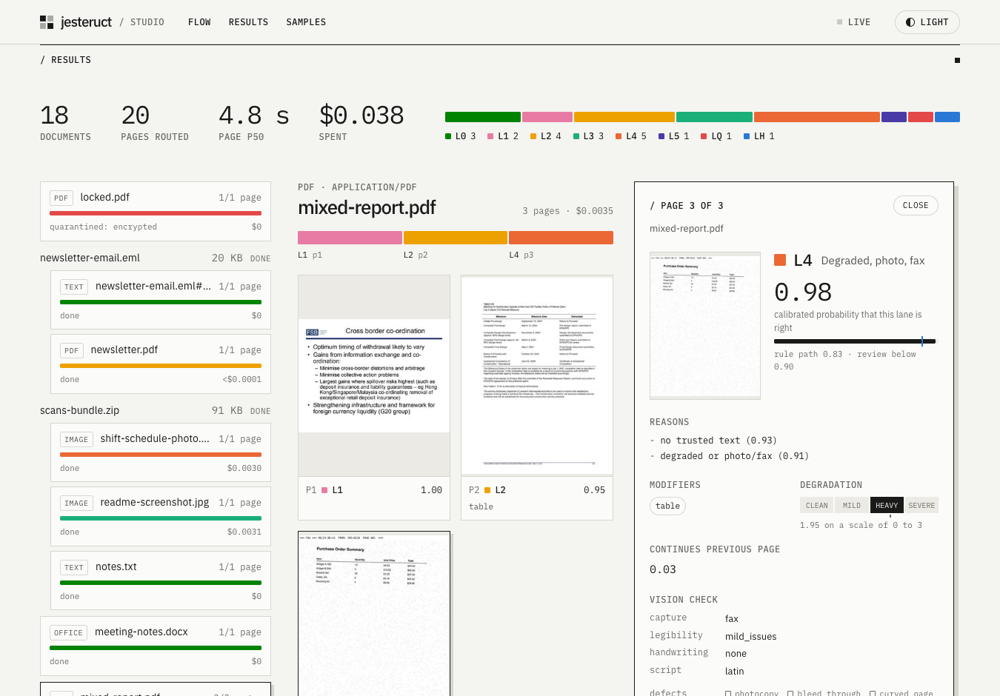

# jesteruct

Routes unstructured documents into processing lanes.

For every page, jesteruct decides whether it is:
- born-digital, simple or complex;
- a clean scan;
- a degraded scan, photo or fax;
- mostly handwritten.

It also flags tables, math, code, forms and scripts, and writes a versioned route manifest for the processing lanes.
TypeSafe Jev makes each decision from cheap page evidence, with a Gemini 3.8 Flash vision check when a page has no trustworthy text layer.
See [docs/ARCHITECTURE.md](docs/ARCHITECTURE.md) for how it works and why.

## Run it natively

Requires Python 3.12, [uv](https://docs.astral.sh/uv/) and an authenticated `gh` (for the model and data release assets).

```bash
cp .env.example .env           # add OPENROUTER_API_KEY
uv sync
make models                    # the text-layer language model (159 MB), checked by sha256
uv run jst route samples/      # manifests in out/
uv run jst view out            # out/report.html: thumbnails, lanes and reasons
uv run jst probe file.pdf      # the evidence for one page, without calling any model
uv run jst evaluate            # route the labelled set in evalset/ and report accuracy
uv run evalset/fresh/build.py fetch   # the 1,717-page fresh set, a release asset rather than files in git
uv run jst evaluate --cases evalset/fresh/cases.jsonl --out out/fresh
uv run jst calibrate out/fresh/results.jsonl   # refit when to send a page to review; never fits on holdout
```

## Run it as a service

```bash
docker run -d -p 6379:6379 valkey/valkey:8
JST_VALKEY_URL=redis://localhost:6379/0 uv run jst worker &
JST_VALKEY_URL=redis://localhost:6379/0 uv run jst serve
curl -F file=@doc.pdf 'localhost:8000/v1/jobs?wait=30'
uv run jst evaluate --api http://localhost:8000   # the labelled set, sent through the service as a user would
```

## Studio

The Studio shows pages moving through the router as it works, and routes any file you drop on it.

```bash
make studio          # builds web/, then runs Valkey, a worker and the API: http://localhost:8000
make studio-cluster  # the Studio of the OrbStack deployment, after make deploy-local
```

To work on it, run the API as above and `cd web && pnpm install && pnpm dev`; Vite proxies `/v1` to port 8000.
With no API reachable, it replays a recorded demo.

| Dark | Light |
|---|---|
|  |  |
|  |  |

## Deploy

```bash
make deploy-local    # OrbStack Kubernetes: KEDA, Valkey, SeaweedFS and the app, via Terraform
make smoke           # submit mixed documents, watch workers scale, check nothing is dead-lettered
```

For a cloud cluster, fill in `infra/terraform/envs/cloud/cloud.example.tfvars` and apply that environment.
CI publishes multi-arch images to `ghcr.io/itssypher/jesteruct`.

## Layout

| Path | Contents |
|---|---|
| `src/jesteruct/` | the router |
| `web/` | the Studio: Svelte and WebGPU, served by the API |
| `evalset/` | labelled pages for `jst evaluate` |
| `deploy/` | Dockerfile and Helm charts |
| `infra/terraform/` | modules and environments |
| `bench/`, `research/` | the experiments and research behind the design |
